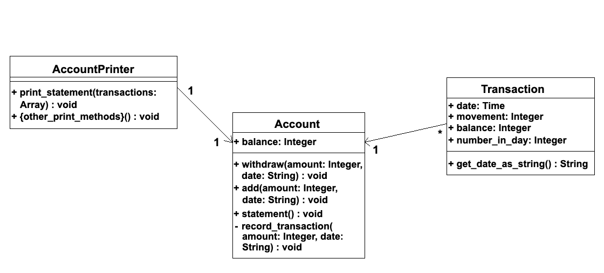

# Bank Tech Test

This is my solution to [this](https://github.com/makersacademy/course/blob/master/individual_challenges/bank_tech_test.md) practice tech test, written in Java.  

This program simulates a simple bank account. It allows money to be added and withdrawn, keeps track of the total balance, creates and prints a statement of transactions and handles a number of edge cases.  

## Instructions for usage

Open your terminal and navigate to a directory in which you would like to save this repo to, then enter the following commands:  

--to add later---

## Specification

I have adapted the full specification (found [here](https://github.com/makersacademy/course/blob/master/individual_challenges/bank_tech_test.md)) into a number of user stories and the class diagram below.

### User stories

As a bank customer,  
So I can keep track of my income and expenses,  
I would like to be able to specify a date for transactions.  

As a bank customer,  
So I know how much money I have,  
I would like for my bank balance to be automatically updated after each transaction.  

As a bank customer,  
So I can add money to my account,  
I would like to be able to set up payments into my account (credits).  

As a bank customer,  
So I can buy things with my account,  
I would like to be able to set up payments from my account (debits).  

### Class diagram

Below is the initially planned class diagram.  

## Code quality

--to add later--

The program is written to account for the following edge cases, with test coverage proving:
* Negative withdrawals and deposits are blocked.  
* Withdrawals that would take the account below 0 balance are blocked.  
* Invalid dates given for transactions are blocked.
* Transactions will be sorted into correct order automatically.

I have ensured that the code is readable and understandable by following ruby conventions - tested using the RuboCop linter.
